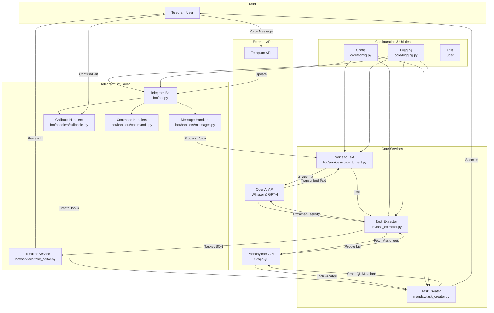

# SpeakToDo - Voice-to-Task Bot

A powerful Telegram bot that converts voice messages into actionable tasks in Monday.com. Simply send a voice message describing your tasks, and SpeakToDo will automatically:

1. 🎙️ Convert your voice to text using OpenAI Whisper
2. 🧠 Extract actionable tasks using AI
3. 📝 Create tasks in your Monday.com board

## Features

- **Voice Recognition**: Converts voice messages to text using OpenAI Whisper (supports OGG, MP3, WAV formats)
- **Intelligent Task Extraction**: Uses OpenAI GPT-4 to analyze text and extract actionable tasks with metadata
- **Interactive Task Review**: Review and edit extracted tasks before creating them in Monday.com
- **Multilingual Support**: Processes voice messages in multiple languages (including Persian/Farsi)
- **Smart Assignee Matching**: Automatically matches mentioned names to Monday.com board members
- **Monday.com Integration**: Creates tasks as subitems under parent project items with proper column mapping
- **Real-time Feedback**: Get status updates as your voice message is processed
- **Automatic Date Resolution**: Converts relative dates ("tomorrow", "Friday") to absolute dates
- **Board Structure Discovery**: Automatically detects and maps to your Monday.com board columns
- **Robust Error Handling**: Includes fallback mechanisms and retry logic for reliability
- **Configurable Logging**: Automatic log rotation with size or time-based strategies

## Prerequisites

Before running the bot, you'll need:

1. **Telegram Bot Token**: Create a bot via [@BotFather](https://t.me/BotFather)
2. **OpenAI API Key**: For voice-to-text and task extraction
3. **Monday.com API Token**: For creating tasks in your boards
4. **Monday.com Board ID**: The board where tasks will be created

## Installation

1. Clone this repository:

```bash
git clone <repository-url>
cd SpeakToDo
```

2. Install dependencies:

```bash
pip install -r requirements.txt
```

3. Install FFmpeg (required for voice processing):

**Windows:**

- Download FFmpeg from [https://ffmpeg.org/download.html#build-windows](https://ffmpeg.org/download.html#build-windows)
- Extract the archive and add the `bin` folder to your system PATH
- Or use Chocolatey: `choco install ffmpeg`
- Or use winget: `winget install FFmpeg.FFmpeg`

**macOS:**

```bash
brew install ffmpeg
```

**Linux (Ubuntu/Debian):**

```bash
sudo apt update
sudo apt install ffmpeg
```

4. Set up environment variables - Create a `.env` file in the project root:

5. Edit `.env` file with your API credentials:

```env
# Required
TELEGRAM_BOT_TOKEN=your_telegram_bot_token_here
OPENAI_API_KEY=your_openai_api_key_here
MONDAY_API_TOKEN=your_monday_api_token_here
MONDAY_BOARD_ID=your_board_id_here

# Optional - SOCKS Proxy (for restricted network access)
SOCKS_PROXY_HOST=your_proxy_host
SOCKS_PROXY_PORT=1080
SOCKS_PROXY_USERNAME=your_username
SOCKS_PROXY_PASSWORD=your_password
SOCKS_PROXY_TYPE=socks5

# Optional - Logging Configuration
LOG_FILE=logs/speaktodo_bot.log
LOG_ROTATION_MODE=size
LOG_MAX_BYTES=10485760
LOG_BACKUP_COUNT=5
```

## Getting API Credentials

### Telegram Bot Token

1. Message [@BotFather](https://t.me/BotFather) on Telegram
2. Send `/newbot` and follow the instructions
3. Save the bot token provided

### OpenAI API Key

1. Visit [OpenAI Platform](https://platform.openai.com/)
2. Create an account and navigate to API Keys
3. Create a new API key and save it

### Monday.com API Token

1. Go to your Monday.com account
2. Click on your avatar → Admin → API
3. Generate a new API token
4. Copy the token

### Monday.com Board ID

1. Open your Monday.com board
2. The Board ID is in the URL: `https://mycompany.monday.com/boards/XXXXXXXXX`
3. Copy the number after `/boards/`

### Monday.com Board Setup

Your Monday.com board must have a **Subitems** column configured:

1. Go to your board in Monday.com
2. Add a **Subitems** column (or **Subtasks** column)
3. Configure it to link to a subitems board (it will be created automatically if needed)
4. The bot will create tasks as subitems under parent project items

**Recommended columns in your subitems board:**

- **People/Owner** column (for task assignees)
- **Date** column (for due dates)
- **Status** column (for task status)
- **Long text** column (for additional task details)

The bot will automatically detect and use these columns if they exist.

## Usage

1. Start the bot:

```bash
python main.py
```

2. Find your bot on Telegram and send `/start`

3. Send a voice message describing your tasks, for example:

   - "I need to call John about the project and schedule a meeting with the marketing team"
   - "Review the budget proposal and send feedback to Sarah by Friday"
   - "Research competitors and update the website homepage"

4. The bot will:
   - Convert your voice to text
   - Extract tasks with metadata (project, assignee, due date)
   - Show you a review screen with all extracted tasks
   - Allow you to edit tasks before confirming
   - Create tasks in Monday.com upon confirmation

### Interactive Workflow

When you send a voice message, the bot will:

1. **Process** your voice and show progress updates
2. **Extract** tasks and display them in a review interface
3. **Allow Editing** - You can:
   - Edit individual task details (title, project, owner, due date)
   - Add new tasks
   - Remove unwanted tasks
4. **Confirm** - Review all changes and confirm to create tasks in Monday.com

## Project Architecture



## Project Structure

```
SpeakToDo/
├── main.py                      # Application entry point
├── bot/                         # Telegram bot implementation
│   ├── bot.py                   # Main bot class orchestrating handlers
│   ├── handlers/                # Message and callback handlers
│   │   ├── commands.py          # Command handlers (/start, /help)
│   │   ├── messages.py          # Voice and text message handlers
│   │   └── callbacks.py         # Interactive button callbacks
│   └── services/                # Bot services
│       ├── voice_to_text.py     # Voice-to-text conversion (OpenAI Whisper)
│       └── task_editor.py       # Task review and editing UI
├── core/                        # Core configuration and utilities
│   ├── config.py                # Configuration management
│   └── logging.py               # Logging setup with rotation
├── llm/                         # AI/LLM services
│   └── task_extractor.py        # GPT-4 task extraction from text
├── monday/                      # Monday.com integration
│   ├── client.py                # GraphQL API client with retry logic
│   ├── task_creator.py          # Task creation and board management
│   ├── board.py                 # Board operations
│   └── people.py                # People/assignee management
├── utils/                       # Utility functions
│   ├── files.py                 # File handling utilities
│   └── log_cleanup.py           # Log cleanup scripts
├── scripts/                     # Helper scripts
│   ├── verify_tasks.py          # Task verification utility
│   ├── test_setup.py            # Setup testing script
│   └── manage_logs.py           # Log management
├── logs/                        # Application logs
│   └── speaktodo_bot.log        # Main log file (auto-rotated)
├── requirements.txt             # Python dependencies
└── README.md                    # This file
```

## Components Overview

### 1. Telegram Bot (`bot/bot.py`)

The main orchestration layer that:

- Handles incoming voice and text messages
- Manages user sessions for interactive editing
- Coordinates between handlers, services, and integrations
- Provides real-time feedback to users

### 2. Message Handlers (`bot/handlers/`)

**Commands** (`commands.py`):

- `/start` - Welcome message and setup instructions
- `/help` - Usage guide and examples

**Messages** (`messages.py`):

- Processes voice messages through the pipeline
- Handles text messages for editing workflows
- Provides user feedback at each processing stage

**Callbacks** (`callbacks.py`):

- Handles interactive button presses
- Manages task editing workflows
- Confirms and creates tasks in Monday.com

### 3. Voice to Text (`bot/services/voice_to_text.py`)

- Converts audio files (OGG, MP3, WAV) to text using OpenAI Whisper API
- Handles audio format conversion (OGG → MP3)
- Provides clear error messages on transcription failure

### 4. Task Extractor (`llm/task_extractor.py`)

- Uses OpenAI GPT-4 to analyze transcribed text and extract actionable tasks
- Supports multilingual input (including Persian/Farsi)
- Resolves assignees by matching against Monday.com board members
- Extracts task metadata:
  - Project/context titles
  - Task descriptions (imperative format)
  - Owners/assignees
  - Due dates (with relative date resolution)
- Includes fallback extraction for reliability

### 5. Task Creator (`monday/task_creator.py`)

- Integrates with Monday.com GraphQL API
- Creates parent items (projects) and subitems (tasks)
- Maps task metadata to board columns automatically:
  - People assignment
  - Due dates
  - Status
  - Custom dropdowns
- Handles board structure discovery and caching
- Includes retry logic and timeout handling

### 6. Task Editor (`bot/services/task_editor.py`)

- Generates interactive review interfaces
- Allows users to edit tasks before creation:
  - Edit task titles
  - Modify project assignments
  - Change owners/assignees
  - Update due dates
  - Add or remove tasks
- Provides confirmation workflow before creating tasks

### 7. Monday.com Integration (`monday/`)

**Client** (`client.py`):

- GraphQL API wrapper with retry logic
- Supports SOCKS proxy configuration
- Handles authentication and error management

**Board** (`board.py`):

- Board structure and column operations

**People** (`people.py`):

- Fetches assignable people from boards
- Manages people-to-task assignments

## Example Voice Messages

Here are some examples of voice messages the bot can process:

**Project Management:**

> "I need to review the quarterly report, schedule a team standup for tomorrow, and follow up with the client about their feedback"

**Personal Tasks:**

> "Call the dentist to schedule an appointment, buy groceries for the weekend, and prepare slides for Monday's presentation"

**Work Planning:**

> "Research our top three competitors, update the pricing page on the website, and send the proposal to the new client"

## Troubleshooting

### Common Issues

1. **"Missing required environment variables"**

   - Make sure all required variables are set in your `.env` file
   - Check that the `.env` file is in the project root directory

2. **"Monday.com connection failed"**

   - Verify your Monday.com API token is correct
   - Ensure the Board ID exists and you have access to it
   - Check that your API token has the necessary permissions

3. **"OpenAI API error"**

   - Verify your OpenAI API key is valid
   - Check that you have sufficient credits in your OpenAI account
   - Ensure the API key has access to GPT and Whisper models

4. **Voice processing fails**

   - Check that the audio file format is supported
   - Ensure the voice message is clear and audible
   - Try with shorter voice messages (under 2 minutes)

5. **"Couldn't find ffmpeg" warning**
   - Install FFmpeg following the installation instructions above
   - On Windows, ensure FFmpeg is added to your system PATH
   - Restart your terminal/command prompt after installation
   - Test FFmpeg installation by running `ffmpeg -version` in terminal

### Logs

SpeakToDo creates detailed logs in the `logs/` folder (default: `logs/speaktodo_bot.log`). Check this file for detailed error information.

**Automatic Log Rotation**: The bot automatically rotates log files to prevent them from growing too large:

- **Size-based rotation** (default): Logs rotate when they reach 10 MB, keeping up to 5 backup files
- **Time-based rotation**: Logs can rotate daily, weekly, or hourly based on configuration

You can configure log rotation in your `.env` file:

```env
# Log file path (default: logs/speaktodo_bot.log)
LOG_FILE=logs/speaktodo_bot.log

# Size-based rotation (default)
LOG_ROTATION_MODE=size
LOG_MAX_BYTES=10485760  # 10 MB in bytes
LOG_BACKUP_COUNT=5      # Keep 5 backup files

# OR Time-based rotation
# LOG_ROTATION_MODE=time
# LOG_ROTATION_WHEN=midnight  # Options: 'D' (daily), 'W0' (weekly), 'H' (hourly), 'midnight'
# LOG_ROTATION_INTERVAL=1     # Rotate every X intervals
# LOG_BACKUP_COUNT=30         # Keep 30 backup files (e.g., 30 days)
```

## Advanced Configuration

### Custom Task Categories

You can modify the task categories in `task_extractor.py`:

```python
valid_categories = ['Meeting', 'Call', 'Email', 'Research', 'Development', 'Planning', 'Review', 'Other']
```

### Monday.com Column Mapping

The bot automatically detects your board columns, but you can customize the mapping in `task_creator.py` by modifying the `_prepare_column_values` method.

## Contributing

1. Fork the repository
2. Create a feature branch
3. Make your changes
4. Add tests if applicable
5. Submit a pull request

## License

This project is licensed under the MIT License. See LICENSE file for details.

## Support

If you encounter any issues or have questions:

1. Check the troubleshooting section above
2. Review the logs in `logs/speaktodo_bot.log`
3. Create an issue on GitHub with detailed information

---

**Happy task management! 🚀**
